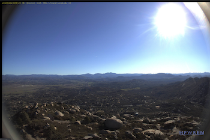
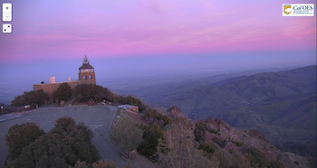
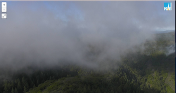
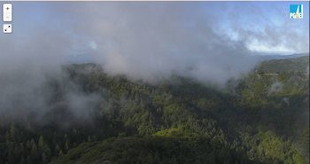

#### Wildfire Smoke Detection Challenge
Do you know there are more than 250 cameras installed around mountaintop in California. These are the AlertWildfire camera system. Another camera system is called HPWREN cameras.

- [AlertWildfire Cameras](http://www.alertwildfire.org/southeastbay/index.html?v=518dd6a)

- [HPWREN Cameras](http://hpwren.ucsd.edu/cameras/I/wc-e-mobo-c.html)

Can you build a wildfire smoke detector for these cameras ? 

   
Image taken by HPWREN camera.

   
Image taken by AlertWildfire camera.

   
Mountain with fog image taken by AlertWildfire camera.

  
Mountain with fog image taken by AlertWildfire camera.

We launched these Wildfire Smoke Detection Challenge IA, IB and II in conjunction of the **[Let’s Stop Wildfires Hackathon](https://github.com/aiformankind/lets-stop-wildfires-hackathon)**. 
You can use your solution as the entry to the Let's Stop Wildfire Hackathon. 

Note: You have to create a github repo with your solution as part of the submission. Save your model in HDF5 format and share it in your repo. If the model size is over 100MB, please provide either Dropbox or Google Drive link to your model. We will load your model and evaluate it against our test dataset.

Learn more about the challenges and how to submit your solution. Note: You can find more about the train datasets in the following links.
- [Challenge IA: Smoke vs No Smoke using entire image](wildfire_smoke_challenge_1A.md)
- [Challenge IB: Smoke vs No Smoke using gridded image](wildfire_smoke_challenge_1B.md)
- [Challenge II: Start of Smoke Ignition](wildfire_smoke_challenge_2.md)

#### Mentors for Hackathon
1. [Adam Kraft](https://www.linkedin.com/in/adam-kraft-7555b534/) Machine Learning Engineer from Google Brain
2. [Anna Bethke](https://www.linkedin.com/in/annabethke/), Head of AI for Social Good for Intel
3. [Jianming Zhang](https://www.linkedin.com/in/jianming-zhang-60762227/), Senior Research Scientist from Adobe Research
4. [Jigar Doshi](https://www.linkedin.com/in/jigarkdoshi/), Machine Learning Lead from [CrowdAI](https://crowdai.com/)
5. [Kinshuk Govil](https://www.linkedin.com/in/kinshuk-govil-0080522/), Lead for Machine Learning based early wildfire detection system with [FUEGO](https://fuego.ssl.berkeley.edu/what-is-fuego/)
6. [Tim Ball](https://www.linkedin.com/in/tim-ball-1832a824/), President of [Fireball International](http://www.fireballit.com/)
7. [Vladimir Iglovikov](https://www.linkedin.com/in/iglovikov/) Kaggle Grandmaster, Senior Computer Vision Engineer at Level5, Self-Driving Division, Lyft Inc.

#### Quick Start
Checkout the following resources to get you started

1. [Dataset: Smoke vs No Smoke Images from HPWREN Camera](https://www.dropbox.com/s/ghfhjtoh1z59xeb/wildfire_smoke_data.tar)

    - This dataset is used in [Challenge IA: Smoke vs No Smoke using entire image](wildfire_smoke_challenge_1A.md)

2. [Dataset: Gridded Smoke vs No Smoke Images from HPWREN Camera](https://www.dropbox.com/s/5rue8c28iidvlvh/grid_smoke_version.tar)

    - This dataset is used in [Challenge IB: Smoke vs No Smoke using gridded image](wildfire_smoke_challenge_1B.md)

3. [Tensorflow Wildfire Smoke Detection Sample Notebook for Challenge 1B](Challenge_1B_WildfireSmokeImageClassifierForDemo.ipynb)

4. [PyTorch Wildfire Smoke Detection Sample Notebook for Challenge 1B](Challenge_1B_WildfireSmokeImageClassifierForDemo_Pytorch.ipynb)  

    - Thank you [Bleklov Dmitry](https://github.com/Bekovmi) for contributing this notebook.

5. [Google Colaboratory to develop deep learning application on free GPU](https://colab.research.google.com)

6. [Transfer learning with a pretrained ConvNet](https://www.tensorflow.org/tutorials/images/transfer_learning)

#### Wildfire Resources
1. [FUEGO Wildfire Detection Slides by Kinshuk Govil](https://tinyurl.com/rbrn4oq)
2. [Wildland Fire Assessment System](http://www.wfas.net/)
3. [The United States Fourth National Climate Assessment Volume II](https://nca2018.globalchange.gov/downloads/NCA4_Report-in-Brief.pdf)
4. [How Wildfire Works](https://science.howstuffworks.com/nature/natural-disasters/wildfire.htm/printable)
5. [Fighting Wildfires](https://mentalfloss.com/article/57094/10-strategies-fighting-wildfires)

#### Tensorflow Resources
1. [Tensorflow Quickstart](https://www.tensorflow.org/tutorials/quickstart/beginner)
2. [Tensorflow Tutorials](https://www.tensorflow.org/tutorials)
3. [Install Tensorflow in PyCharm](https://youtu.be/vEXCMOuPB3c)
4. [What is transfer learning? Exploring the popular deep learning approach](https://builtin.com/data-science/transfer-learning) 
5. [Transfer learning in TensorFlow 2 tutorial](https://adventuresinmachinelearning.com/transfer-learning-tensorflow-2/)
6. [Deep learning unbalanced training data](https://towardsdatascience.com/deep-learning-unbalanced-training-data-solve-it-like-this-6c528e9efea6)

#### Papers
1. [Do Better ImageNet Models Transfer Better?](https://www.zpascal.net/cvpr2019/Kornblith_Do_Better_ImageNet_Models_Transfer_Better_CVPR_2019_paper.pdf)
2. [SpotTune: Transfer Learning through Adaptive Fine-tuning](http://openaccess.thecvf.com/content_CVPR_2019/papers/Guo_SpotTune_Transfer_Learning_Through_Adaptive_Fine-Tuning_CVPR_2019_paper.pdf)
3. [Taskonomy: Disentangling Task Transfer Learning](http://openaccess.thecvf.com/content_cvpr_2018/papers/Zamir_Taskonomy_Disentangling_Task_CVPR_2018_paper.pdf)

#### Contact Us
If you have any questions, please feel free to

Email us at [ai.for.mankind@gmail.com](ai.for.mankind@gmail.com)

#### Join us on Slack  

You can join our Slack channel to collaborate and ask questions. [https://tinyurl.com/vepdjpf](https://tinyurl.com/vepdjpf)

By participating in this hackathon, participants agree to be bound by all of the terms and conditions as set out in the hackathon [rules](README.md)

